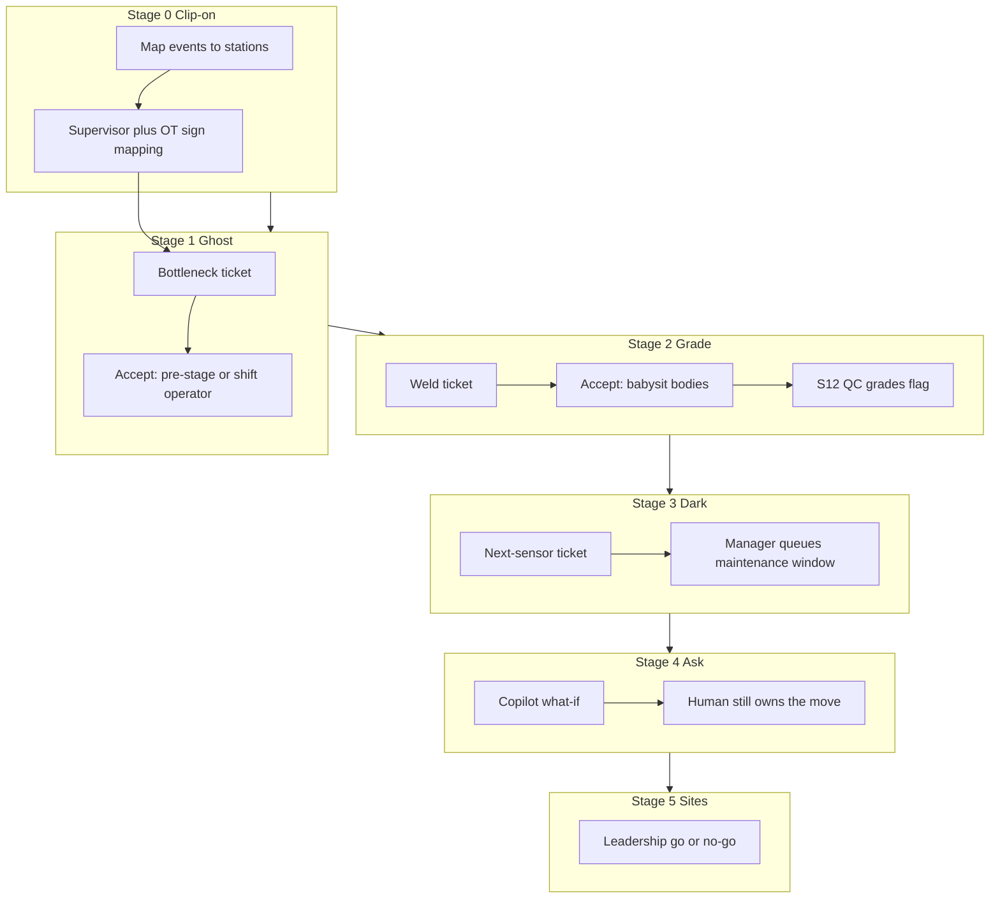
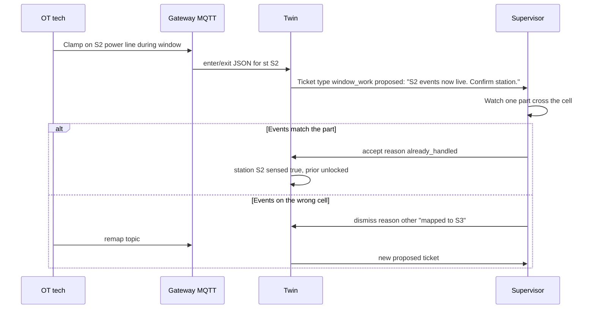
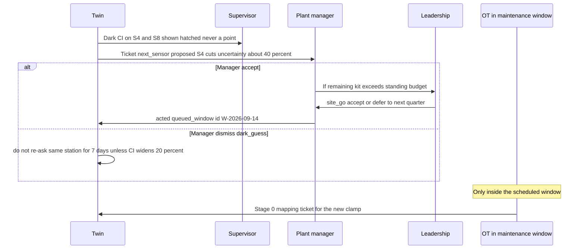
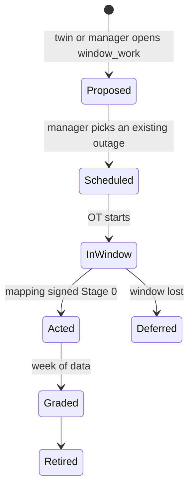

# DigitalTwin.ai — Human-in-the-Loop PRD

**Track 4 · Round 2**  
**Status:** product spec for advisory HITL (what the twin proposes, what a human must do, what gets graded later)  
**Companion docs:** [PRD.md](PRD.md) (stage-wise product flows), [PROPOSAL.md](../PROPOSAL.md) (business case), [README.md](../README.md) (how to run), Ops prototype (`pages/ops.html`)

This is not a closed-loop control spec. The twin **never writes a PLC, never moves a robot, never opens a clamp**. Every prediction is a proposal. A named person accepts, defers, or dismisses it. Later, the plant grades whether that call was right.

---

## 1. Why HITL is the product

Three constraints from the Round 2 brief force a human in the loop:

1. **IT/OT freeze.** Live production systems cannot be modified except in scheduled maintenance windows. Advice that auto-executes is a safety and union non-starter.
2. **False alarms kill trust.** Isolation Forest + autoencoder will fire on mix shifts, dressing cycles, and noise. If those alerts pile up ungraded, supervisors mute the board.
3. **Dark stations and delayed defects.** The twin is often *early and uncertain* (S3 weld flag at Body, QC only at S12). A human has to babysit bodies that have not failed yet.

HITL is therefore not a UI garnish. It is the **control surface**. The engine is Sense → Mirror → Predict → Ask. HITL is the fifth move: **Decide**, then **Grade**.

```
Sense → Mirror → Predict → Ask → Decide → Act on the floor → Grade at inspect / shift-end → Retrain thresholds
                                      ▲                                                         |
                                      └──────────── trust / mute / next-sensor budget ──────────┘
```

---

## 2. HITL contract (every stage)

### 2.1 Roles

| Role | Alias in Ops | Authority | Cannot do |
| --- | --- | --- | --- |
| **Floor supervisor** | Supervisor desk | Acknowledge alerts, pick a floor move, hold bodies, dismiss with a reason | Write PLC, approve capex, change detector thresholds |
| **Cell operator** | (on the line, not a login) | Execute the supervisor’s move (pre-stage buffer, shift, re-weld) | Change twin settings |
| **QC inspector** | S12 inspect (system + person) | Pass/fail the body; this *is* the grade | Override Body weld physics |
| **Plant manager** | Manager desk | Freeze/unfreeze detectors, pick next sensor, accept a shift plan | Closed-loop control |
| **Leadership** | Leadership desk | Go / no-go on a site, sensor budget, “copy to three shops” | Day-to-day alerts |
| **Twin** | Engine + copilot | Propose, forecast, bound dark cells, never act | Any actuator, any silent dismiss |

### 2.2 Decision object

Every HITL item is a **ticket**. Same schema at every stage so the audit trail is one table.

| Field | Values |
| --- | --- |
| `id` | `TWIN-{date}-{seq}` |
| `type` | `bottleneck` · `weld_suspicious` · `weld_confirmed` · `bodies_at_risk` · `dark_ci` · `next_sensor` · `what_if` · `window_work` · `site_go` |
| `severity` | `info` · `watch` · `act_now` |
| `evidence` | tool name, rolls, ms, CI, body IDs, station |
| `state` | `proposed` → `acked` → `acted` \| `deferred` \| `dismissed` → `graded` → `retired` |
| `decision` | `accept` · `defer` · `dismiss` |
| `reason_code` | see §2.4 |
| `actor` | role + badge id |
| `sla` | time to first ack (supervisor: 60 s for `act_now`) |
| `grade` | `tp` · `fp` · `fn` · `tn` · `n/a` (filled later) |

**Invariant:** the twin may *create* `proposed`. Only a human may leave `proposed`. Silent expiry is a **missed SLA**, logged as `deferred` by the system with reason `sla_timeout`, never as a fake accept.

### 2.3 Decision verbs (always three)

| Verb | Meaning on the floor | Twin behaviour after |
| --- | --- | --- |
| **Accept** | I will do something physical or I will babysit these bodies | Ticket → `acted`. Bodies stay on at-risk until S12. Detector stays live. |
| **Defer** | Not now (end of cycle, break, waiting for window) | Ticket → `deferred`. Re-fire if evidence worsens. Do not spam. |
| **Dismiss** | Twin is wrong *for a stated reason* | Ticket → `dismissed`. Counts toward false-alarm review. Does **not** delete the body from at-risk if a weld flag already stuck. |

There is no fourth verb “let the model do it.”

### 2.4 Dismiss / defer reason codes

Supervisors pick from a short list so managers can see *why* trust is leaking.

| Code | Used when |
| --- | --- |
| `mix_shift` | SUV vs sedan; posterior still catching up |
| `dressing_cycle` | Known weld-tip dress; current spike is scheduled |
| `manual_check_ok` | Operator already looked; cell is fine |
| `dark_guess` | Alert leans on a dark station CI; too wide to act |
| `already_handled` | Buffer already pre-staged / operator already moved |
| `waiting_window` | Needs hardware or PLC-adjacent work |
| `copilot_misread` | Question was parsed wrong; re-ask |
| `other` | Free text, 140 chars, reviewed weekly |

### 2.5 What the twin is forbidden to do

- Write a setpoint, speed, or interlock.
- Auto-clear a weld flag because a supervisor dismissed a *bottleneck* ticket (different type).
- Show a dark station as a single number without `[lo–hi]`.
- Answer a copilot question from LLM weights. Evidence line must be `▸ twin: {tool} · {rolls} rolls · {ms} ms`.
- Install a sensor outside a **maintenance window** ticket.

---

## 3. Stage map

Same phases as [PROPOSAL.md](../PROPOSAL.md) §5. HITL gets stricter as the plant trusts the board. Early stages optimize for **ack + reason**. Later stages add **budget and freeze**.

| Stage | When | Twin is allowed to propose | Human must | Grade that closes the loop |
| --- | --- | --- | --- | --- |
| **0 · Clip-on** | Day 1, one shift | “Is this event mapped to the right station?” | Supervisor + OT confirm mapping | Mapping signed off |
| **1 · Ghost** | Week 1 | Bottleneck `act_now` / `watch` | Supervisor accept → floor move, or dismiss | Did starvation happen in the next 20 min (shop) / 20 s (demo)? |
| **2 · Grade** | Week 2–3 | Weld suspicious / confirmed + at-risk list | Supervisor hold/babysit; QC pass/fail | Confusion matrix TP/FP/FN/TN |
| **3 · Dark honesty** | Week 3 | Next-sensor recommendation + CI watch | Manager accept into **next window** backlog | Did CI width drop after install? |
| **4 · Ask** | Ongoing | What-if / forecast / QC narrative | Human treats answer as evidence, still decides | Copilot misparse rate (`copilot_misread`) |
| **5 · Three sites** | After one shop trusts it | Copy playbook + local priors | Leadership go/no-go per site | Site false-alarm % vs home shop |

Demo scale vs shop scale: Ops uses **seconds** so a judge can watch a loop. Shop SLA uses **minutes**. The state machine is identical.



---

## 4. Stage 0 — Clip-on (Day 1)

**Goal.** Events are believed. HITL here is “did we clip the right cable?” not “is S3 the constraint?”

### 4.1 Actors

OT tech, floor supervisor, one gateway owner.

### 4.2 Flow — event mapping sign-off



### 4.3 Decision table

| Ticket | Accept | Defer | Dismiss |
| --- | --- | --- | --- |
| Mapping confirmation | Unlock Bayesian updates for that station | Wait for next part | Remap topic; do not train on garbage |

### 4.4 Failure modes

- Training the posterior on the wrong station (silent). Mitigation: Stage 0 tickets **block** Stage 1 alerts on that station until `acted`.
- Camera tripwire covering two stations. Mitigation: one ticket per tripwire pair; supervisor walks the cone.

### 4.5 Prototype today

Not a login workflow. Story chapter **Setup** + Ops assumption “8 sensed / 4 dark.” Treat Stage 0 as **pre-demo**: the 12-station line is already mapped.

---

## 5. Stage 1 — Ghost (Week 1)

**Goal.** Catch a bottleneck forming. Supervisor moves people and buffers. Twin does not slow the cell.

### 5.1 Trigger

Monte Carlo + active-period rank: station *i* is the constraint in ≥60% of rollouts, or first-hit time inside the horizon (demo: 24 s; shop: 20–30 min).

### 5.2 Flow — bottleneck `act_now`

```mermaid
sequenceDiagram
  participant Floor as Physical line
  participant Twin as Twin Predict
  participant Sup as Supervisor
  participant Op as Operator
  Floor->>Twin: enter/exit events
  Twin->>Twin: 300 rollouts ghost plus 20s
  Twin->>Sup: Ticket bottleneck act_now S3. Advisory: pre-stage S4 buffer, shift one operator.
  alt Ack within SLA
    Sup->>Twin: acked
    alt Accept
      Sup->>Op: Pre-stage buffer at S4 / cover S3
      Op->>Floor: Physical move
      Sup->>Twin: acted
    else Defer waiting_window or already_handled
      Twin->>Twin: suppress repeats unless rank worsens by 15pp
    else Dismiss mix_shift or dressing_cycle
      Twin->>Twin: log dismiss; do not hide the ghost lane
    end
  else SLA timeout 60s demo / 3 min shop
    Twin->>Twin: deferred sla_timeout; escalate banner stays
  end
  Note over Twin,Sup: Grade later: did S4/S5 starve in the forecast window?
```

### 5.3 Screen (Supervisor)

1. Ghost lane turns red/slow on S3 **before** the floor chip does.
2. Bottleneck bars; alert card with the **exact advisory sentence** (no PLC language).
3. Three buttons on the ticket: Accept / Defer / Dismiss + reason chips.
4. Event log line: `t=…s  supervisor accept bottleneck S3`.

### 5.4 Grade (closes Stage 1)

| Predicted | What happened in horizon | Grade |
| --- | --- | --- |
| Constraint S3 | Downstream starve or S3 longest-active wins | `tp` |
| Constraint S3 | Line stayed green | `fp` |
| No ticket | Starvation anyway | `fn` |
| No ticket | Green | `tn` |

Manager sees these as **bottleneck grades**, separate from weld QC (Stage 2). Mixing them is how plants lose the plot.

### 5.5 Prototype today

Alert card + inject/recover. **Missing HITL:** Accept/Defer/Dismiss on the bottleneck card. Spec for the next UI pass: those three verbs on `#alert`.

---

## 6. Stage 2 — Grade (Week 2–3)

**Goal.** Defects are caught at Body and **honestly scored** at Final. This is the HITL loop that keeps detectors alive.

Two tickets, one body:

1. `weld_suspicious` — Isolation Forest only. Watch, do not tear the line down.
2. `weld_confirmed` — autoencoder agrees. Babysit until S12.

### 6.1 Flow — weld flag to QC grade

```mermaid
sequenceDiagram
  participant S3 as S3 weld cell
  participant Twin as Twin
  participant Sup as Supervisor
  participant Line as Stations S4 to S11
  participant QC as S12 inspect
  participant Mgr as Plant manager
  S3->>Twin: weld current sample
  Twin->>Twin: Isolation Forest
  Twin->>Sup: Ticket weld_suspicious watch
  Sup->>Twin: accept or dismiss dressing_cycle
  Twin->>Twin: Autoencoder on window
  Twin->>Sup: Ticket weld_confirmed act_now plus body IDs
  Sup->>Line: Babysit at-risk list; optional re-weld if policy allows
  Note over Line: Bodies carry latent weldDefect. Twin does not stop the conveyor.
  Line->>QC: Body arrives
  QC->>Twin: evt qc pass or fail
  Twin->>Twin: gradeBody TP FP FN TN
  Twin->>Mgr: False-alarm percent this shift
  alt FA over freeze threshold 25 percent of alerts, n at least 20
    Mgr->>Twin: Ticket type window_work: freeze AE confirm until retune
  end
```

### 6.2 Supervisor playbook

| Twin state | Accept means | Dismiss means | Never |
| --- | --- | --- | --- |
| Suspicious | Put body on watch list; tell S3 operator to glance at tips | `dressing_cycle` / `mix_shift` | Scrap the body from a suspicious-only flag |
| Confirmed | Babysit all flagged IDs until inspect; queue re-weld if the plant’s quality policy says so | Only with `manual_check_ok` after a **physical** look | Clear the at-risk list |
| Bodies at risk | Walk the list at each break; none silently drop | N/A | Assume Final will catch it without the list |

**Rule of ten (HITL version):** Accept-on-confirmed is a 1× fix (re-weld / hold). Waiting for S12 with no babysit is a 10× tear-up. The ticket exists so that choice is **named**.

### 6.3 QC inspector playbook

The inspector does not “agree with the twin.” They **pass or fail the body**. The twin grades itself.

| Inspect | Twin had flagged | Result |
| --- | --- | --- |
| Fail | Yes | TP — keep detector |
| Pass | Yes | FP — reason codes from supervisor reviewed; if `dressing_cycle` dominates, retune |
| Fail | No | FN — missed defect; raise sensitivity or add a sensor (Stage 3) |
| Pass | No | TN |

Manual checklist stations (dark / no camera): inspector still pass/fails. The twin cannot invent a weld curve. FN on a dark weld cell is expected; that is a **next-sensor** argument, not a detector bug.

### 6.4 Manager freeze rule

If `falseAlarmPct > 25` and `graded ≥ 20` in a rolling shift:

1. Twin opens `window_work` **proposed** for the manager (not the supervisor).
2. Manager **accept** → Isolation Forest still shows `watch`, autoencoder **confirm** is muted until a retune ticket closes.
3. Manager **dismiss** → live with the FA; logged.

This is how “false alarms die” without a data-science intern on nights.

### 6.5 Prototype today

Flags, at-risk list, confusion matrix, copilot `qc_grade`. **Missing HITL:** supervisor verbs on weld tickets; manager freeze control. Spec those as the Stage 2 UI.

---

## 7. Stage 3 — Dark honesty (Week 3)

**Goal.** Partial instrumentation stays useful. Humans spend ₹7k only where CI width is the problem.

### 7.1 Trigger

`recommendNextSensor`: widest 80% CI among dark cells, with an estimated uncertainty cut.

### 7.2 Flow — next sensor is a **window** ticket, not a floor panic



### 7.3 Decision table

| Actor | Accept | Defer | Dismiss |
| --- | --- | --- | --- |
| Supervisor | N/A (cannot spend) | May comment `already_handled` if they already distrust S4 | May flag `dark_guess` as a *note*, not a spend |
| Manager | Queue clamp for next window | `waiting_window` if the next outage is too soon to kit | Not the constraint / CI too theoretically |
| Leadership | Unlock budget for that window | Quarterly capex cycle | Do not instrument this site yet |

### 7.4 Grade

After install + 1 week of events: CI width on that station should drop. If it does not, the mapping (Stage 0) is wrong — reopen Stage 0, do not blame the optimizer.

### 7.5 Prototype today

Coverage map + next-sensor card. **Missing HITL:** queue-for-window button that creates `window_work` rather than pretending the clamp appears live (Recover is a **demo** of a window, not a sensor purchase).

---

## 8. Stage 4 — Ask (ongoing)

**Goal.** Anyone can question the line. The human still owns the decision. The copilot is a **witness**, not a manager.

### 8.1 Flow — tool-calling HITL

```mermaid
sequenceDiagram
  participant User as Supervisor or manager
  participant UI as Ask panel
  participant Copilot as parseIntent
  participant Sim as Engine tools
  User->>UI: "What if Station 4 runs 15 percent slower on night shift?"
  UI->>Copilot: parseIntent
  Copilot->>Sim: what_if station 3 factor 1.15
  Sim->>UI: runLine plus answer
  UI->>User: Evidence: 80 rolls, N ms, throughput drop, constraint
  User->>User: Still Accept/Defer/Dismiss a bottleneck or staffing ticket
  opt Misparse
    User->>UI: dismiss copilot_misread; rephrase
  end
```

### 8.2 Allowed tools vs required human follow-up

| Tool | Twin may say | Human still must |
| --- | --- | --- |
| `run_forecast` | Who is the constraint, when, confidence | Stage 1 ticket if they will move people |
| `what_if` | Throughput delta **if** a station slows | Not a night-shift schedule change until manager accepts |
| `weld_status` | Suspicious vs confirmed | Stage 2 accept/dismiss |
| `bodies_at_risk` | IDs and location | Physical babysit |
| `qc_grade` | TP/FP/FN/TN | Freeze rule (manager) |
| `recommend_sensor` / `estimate_dark` | CI and cut % | Stage 3 window ticket |
| `cycle_belief` | Posterior ± band | Do not treat as a stop-the-line |

### 8.3 Guardrails

- Show `▸ twin: {tool} · {rolls} rolls · {ms} ms` **before** the prose.
- If parse confidence is low (no station, no %), copilot asks a clarifying chip instead of guessing Station 4.
- What-if results are **not** stored as injected scenarios unless the user hits a separate “Save as scenario” (manager-only). Prototype inject is a demo switch, not this path.

### 8.4 Prototype today

Presets + Ask on the supervisor board. **Missing HITL:** `copilot_misread` chip; promoting a what-if into a Stage 1 ticket.

---

## 9. Stage 5 — Three sites

**Goal.** Copy the playbook, not a frozen model. Each site has its own supervisor and its own false-alarm freeze.

### 9.1 Flow — site go / no-go

```mermaid
sequenceDiagram
  participant Home as Shop A manager
  participant Lead as Leadership
  participant Site as Shop B supervisor
  Home->>Lead: Ticket site_go evidence FA percent catch percent coverage
  Lead->>Lead: Accept Shop B with Shop A priors as Bayesian start
  Lead->>Site: Stage 0 window scheduled
  Site->>Site: Stages 0 to 2 locally; freeze thresholds are local
  Note over Site: Dismiss codes stay local. Do not average FA across plants.
```

### 9.2 Decision table

| Accept | Defer | Dismiss |
| --- | --- | --- |
| Same layout family, OT will support Stage 0 | Wait for Shop A freeze rate to settle 4 weeks | Different PLC vendor **is not a dismiss** (we do not write PLCs). Dismiss if no inspect gate to grade welds |

### 9.3 Prototype today

Leadership cost card (3 × 12-station kit). **Missing HITL:** explicit go/no-go control; copy is narrative, which is correct for Round 2.

---

## 10. Cross-cutting flows

### 10.1 Maintenance window (the only time hardware changes)

Used by Stage 0 mapping, Stage 3 sensors, Stage 2 detector retune, demo **Recover**.



**Recover in maintenance window** in Ops is this state machine collapsed to one button so judges see “not a live PLC write.”

### 10.2 Escalation

| If | Then |
| --- | --- |
| `act_now` unacked past SLA | Banner stays; manager dashboard shows missed SLA count (not auto-accept) |
| Three dismisses of the same `type`+station in one shift | Manager ticket: “detectors vs floor disagreement” |
| FN weld (fail at S12, never flagged) | Auto `weld_confirmed`-class review; do not page the night supervisor unless policy says so |
| Copilot used for a safety interlock question | Refuse: canned line “Advisory twin. Talk to OT. No PLC.” |

### 10.3 Audit (minimum fields to export)

`timestamp, ticket_id, type, station, body_ids, state, verb, reason_code, actor_role, evidence_tool, rolls, ms, grade`.  
Enough to reconstruct a WEF-style “operator accepted or rejected the recommendation” story without claiming SCADA write-back.

---

## 11. SLA and UX rules

| Item | Supervisor | Manager | Leadership |
| --- | --- | --- | --- |
| Primary loop | Seconds | Shift / week | Quarter |
| `act_now` ack | 60 s (demo) / 3 min (shop) | n/a | n/a |
| Weld confirm babysit | Until those IDs hit S12 | Review FA daily | See catch vs FA on the leadership card |
| Sensor spend | Comment only | Queue window | Unlock budget |
| Copilot | Allowed | Allowed | Optional; they should not live in Ask |

**Mobile:** supervisor ack must work with a 40 px target (already the Ops button size). Dismiss always requires a reason chip — never a bare X.

**Reduced motion:** tickets still change state; no dependency on the ghost animation to ack.

---

## 12. Requirements traceability (R2 brief → HITL)

| Brief complexity | HITL mechanism |
| --- | --- |
| Uneven sensor coverage | Stage 3 tickets; dark CI never actionable as a point; supervisor may `dismiss dark_guess` |
| Multi-causal / intermittent | Reason codes `mix_shift`, `dressing_cycle`; freeze if FA spikes |
| No PLC / rare windows | Stage 0/3 `window_work`; recover labeled as window; no actuator API |
| Delayed defect | At-risk list + Stage 2 accept = babysit; grade only at S12 |
| Three stakeholder views | Verbs split by role (§2.1); same ticket store |
| Multi-site variation | Stage 5 local freeze and local Stage 0 |
| False alarms vs trust | QC confusion matrix + manager freeze + dismiss codes |

---

## 13. What to implement next in the prototype (priority)

The engine already produces evidence. HITL is the **verbs**.

1. **P0 — Supervisor ticket bar** on bottleneck + weld cards: Accept / Defer / Dismiss + reason chips; write to an in-memory `tickets[]` log (same pattern as `notes` in `ops-ui.js`).
2. **P0 — Do not drop at-risk IDs** on dismiss of a bottleneck ticket.
3. **P1 — Manager freeze** when FA% exceeds 25% with n≥20 (even if simulated n is small, show the control disabled with the rule printed).
4. **P1 — Next sensor “Queue for window”** creates `window_work` instead of installing live.
5. **P2 — Copilot `copilot_misread`** and “Promote to ticket.”
6. **P2 — Export audit JSON** from Ops for the README (“this is the HITL log”).

Out of scope for the hackathon (say so in the proposal): badge SSO, historian write, electronic work instructions, union-grade time-and-attendance.

---

## 14. Assumptions (same as the rest of the submission)

- 12 stations stand in for 30–50.
- ~70% sensed / ~30% dark.
- Simulated events; QC grades are simulated pass/fail vs latent `weldDefect`.
- Advisory only.
- Shop-scale times in this PRD; Ops demo is sped up.

---

## 15. Success for HITL (how we know this spec worked)

A floor supervisor can explain, in one sentence, **what they did with the last alert and how they will know tonight whether they were right.** If they cannot, the twin is a dashboard, not a loop.
