# DigitalTwin.ai — Stage-wise Product PRD

**Track 4 · Round 2**  
**Status:** product requirements (what the twin is, how it rolls out, how each stage flows)  
**Companions:** [HITL-PRD.md](HITL-PRD.md) (tickets, Accept/Defer/Dismiss), [PROPOSAL.md](../PROPOSAL.md) (business case), [README.md](../README.md) (how to run), Ops prototype (`pages/ops.html`)

This PRD is the **stage-wise product spec**. HITL is the control surface inside those stages. The proposal is the judge-facing business write-up.

---

## 0. One-page product

A **clip-on advisory twin** for a mixed-model vehicle assembly shop. Stations emit tiny timestamped events. The twin mirrors the line as a Bayesian discrete-event model, predicts bottlenecks and weld drift, and answers questions by running the simulation — never by writing a PLC.

```
Sense → Mirror → Predict → Ask → Decide (HITL) → Act on the floor → Grade at inspect → Retrain / next sensor
```

| Must | Must not |
| --- | --- |
| Work with uneven coverage (~70% sensed / ~30% dark) | Invent a point estimate on a dark cell |
| Catch a constraint *before* starvation | Auto-slow a cell |
| Flag a Body weld that only fails at Final inspect | Treat S12 fail as a Final-line root cause |
| Grade every weld flag against QC | Let ungraded alerts pile up |
| Serve three desks from one engine | Build three separate models |
| Retrofit only in scheduled windows | Write setpoints, speeds, or interlocks |

**Stand-in plant (stated to judges):** 12 stations in Body / Paint / Final stand in for a 30–50 station shop. Demo clock is seconds so a loop is watchable; shop SLA is minutes. The state machine is the same.

---

## 1. Users, objects, plant

### 1.1 Users

| Desk | Job | Primary loop |
| --- | --- | --- |
| **Floor supervisor** | Is the line about to starve? Which bodies do I babysit until inspect? | Seconds (demo) / minutes (shop) |
| **Cell operator** | Execute the supervisor’s move (pre-stage buffer, cover a cell, glance at tips) | Cycle time |
| **QC inspector** | Pass/fail the body at S12. This *is* the grade. | Per body |
| **OT tech** | Clip clamps, remap MQTT topics, only inside a window | Maintenance windows |
| **Plant manager** | Shift number, constraint heat, false-alarm %, next ₹7k sensor | Shift / week |
| **Leadership** | Buy / refuse / copy to three sites | Quarter |

### 1.2 Plant (stand-in)

| Shop | Stations | Notes |
| --- | --- | --- |
| Body | S1 stamp, S2 form, **S3 weld**, **S4 bolt (dark)**, S5 hang | Weld current scored here; defect is latent until S12 |
| Paint | **S6 prime (dark)**, S7 basecoat, **S8 bake (dark)**, S9 clear | Bake is slow and dark — CI honesty matters |
| Final | S10 trim, **S11 chassis (dark)**, **S12 inspect** | QC event only here |

Coverage: 8 sensed / 4 dark. Named dark cells in copy: **S4** and **S8**. Mixed-model bodies: `A-####` sedan (×1.0 cycle), `B-####` SUV (×1.12). Four-slot buffers between stations. Infinite supply at S1 (stand-in for a full body shop).

### 1.3 Event contract (Sense)

Nothing but events leaves a station. No video, no faces, no PLC tags.

```json
{"st":"S3","evt":"enter","body":"A-4182","ts":"08:14:02.113"}
{"st":"S3","evt":"exit","body":"A-4182","cycle_s":4.18,"ts":"08:14:06.290"}
{"st":"S12","evt":"qc","body":"A-4182","pass":false,"flagged":true,"ts":"08:22:11.004"}
```

Dark stations emit **nothing**. The twin still ticks them from flow conservation.

Weld current is a side-channel on S3 only: a 1-D sample per tick while a body is in the cell. Isolation Forest then autoencoder score that window. Published ~97% weld-quality papers **motivated** the detectors; this prototype does **not** claim that accuracy.

---

## 2. End-to-end architecture flow

Same engine for every stage and every desk.

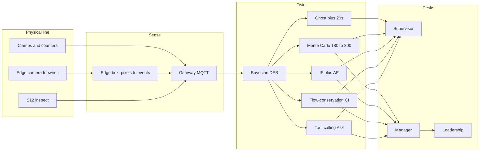

**Hard rules on this diagram**

- Arrow from twin → desks is **advice**. There is no arrow from twin → clamp / PLC / robot.
- Recover / new sensor / remapping travel **OT → window → gateway**, then a Stage 0 mapping ticket.
- Copilot may only call: `run_forecast`, `what_if`, `weld_status`, `bodies_at_risk`, `qc_grade`, `recommend_sensor`, `estimate_dark`, `cycle_belief`. Evidence line: `▸ twin: {tool} · {rolls} rolls · {ms} ms`.

---

## 3. Stage map

Stages stack. You do not skip Stage 0 because “the demo is already mapped.” In a real shop, Stage 0 **blocks** Stage 1 alerts on a station until mapping is `acted`.

| Stage | When | Twin is allowed to say | Human owns | Grade that closes the loop | Prototype today |
| --- | --- | --- | --- | --- | --- |
| **0 · Clip-on** | Day 1, one shift | “Events on this topic are station X” | OT + supervisor sign mapping | Mapping signed; posterior unlocked | Pre-demo: 12 stations already mapped |
| **1 · Ghost** | Week 1 | Next constraint, when, confidence | Supervisor move people/buffers | Did downstream starve in the horizon? | Floor vs ghost, bottleneck bars, inject |
| **2 · Grade** | Week 2–3 | Weld suspicious / confirmed + at-risk IDs | Supervisor babysit; QC pass/fail | TP / FP / FN / TN at S12 | Flags, at-risk list, confusion matrix |
| **3 · Dark honesty** | Week 3 | CI band + next-sensor cut % | Manager queues **window**, not live install | CI width after install | Hatched chips, coverage map, next-sensor card |
| **4 · Ask** | Ongoing | Tool result as evidence | Human still Accept/Defer/Dismiss | Copilot misparse rate | Presets + Ask panel |
| **5 · Three sites** | After one shop trusts it | Copy playbook + local priors | Leadership go/no-go | Site FA% vs home shop | Leadership cost / risk card |

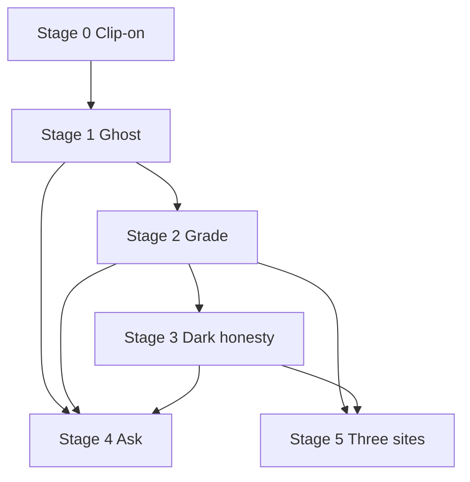

Ask (Stage 4) starts as soon as Ghost exists; it does not wait for three sites. Three sites wait for Grade + Dark honesty so you are not copying a toy.

Demo vs shop time: Ops uses **seconds**. Shop uses **minutes**. Tickets, verbs, and grades do not change.

---

## 4. Stage 0 — Clip-on (Day 1)

### 4.1 Goal

Events are believed. The twin boots from **standard times as Bayesian priors** so it is useful before it has seen a shift of data. HITL here is “did we clip the right cable?” not “is S3 the constraint?”

### 4.2 What ships / what does not

| Ships | Does not |
| --- | --- |
| Current clamps, part counters, one camera covering up to four stations | PLC open, MES, 3D scan |
| Edge box: tripwires → `enter`/`exit` | Video leaving the box |
| MQTT gateway | Historian cut-over |
| Twin process with priors unlocked **per signed station** | Alerts on unsigned stations |

Retrofit cost (story): ₹6–8k per station; a five-station bay with gateway in one shift ≈ ₹1–1.5 lakh. Remaining dark cells on the 12-station stand-in: 4 × ₹7k ≈ ₹28k.

### 4.3 System flow — one station coming online

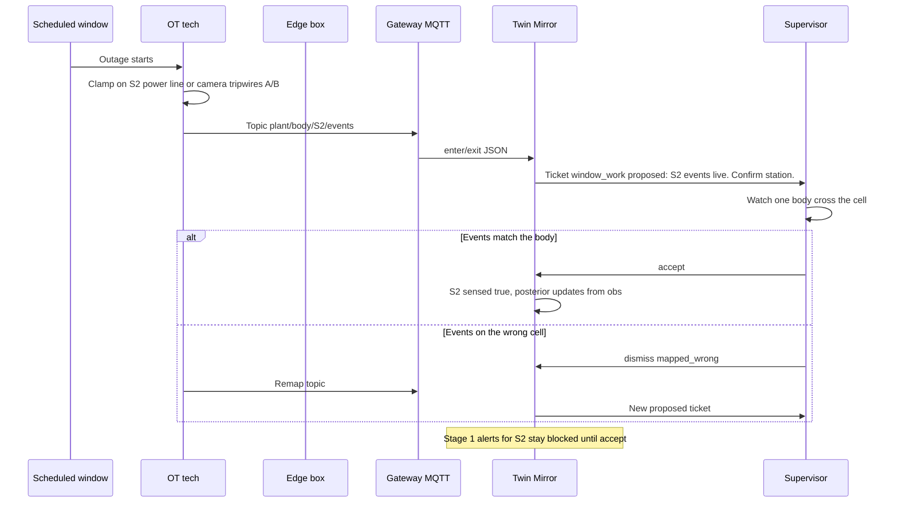

### 4.4 User flow — supervisor walk-the-line

1. OT radios “S2 is live.”
2. Supervisor stands at S2, watches one sedan enter and exit.
3. Event log shows `S2 enter` then `S2 exit` with a plausible `cycle_s` (~4 s, not 40 s, not 0.1 s).
4. Accept unlocks the posterior. Belief starts at prior 4.0 s and walks toward the truth over the next tens of parts.
5. If the log fires when the body is still in S1, dismiss and remap. Do **not** train.

### 4.5 Data flow

```
physical cycle → clamp or tripwire → {enter, exit, cycle_s} → obs[] on station
prior (standard time, kappa=4) + obs → posterior mean/sd
dark stations: no obs; Stage 0 does not invent them
```

### 4.6 Acceptance

- [ ] Each sensed station has a signed mapping ticket.
- [ ] Unsigned stations cannot raise Stage 1 `act_now`.
- [ ] Camera path: frames discarded on the edge box; only events on the wire.
- [ ] One tripwire pair = one station. Two stations in one cone = fail Stage 0.

### 4.7 Prototype

Ops assumes mapping already signed (8 sensed / 4 dark). Story chapters **Sensing** and **Setup** are the Stage 0 explainer. Do not pretend Recover installs a new physical clamp; Recover is a **window** demo for Stage 1/2 inject.

---

## 5. Stage 1 — Ghost (Week 1)

### 5.1 Goal

Show the floor **now** and the line **+20 s (demo) / +20–30 min (shop)** as a dashed ghost. Rank the next constraint with **active-period** (longest uninterrupted busy streak). Utilization lies: a cell can run at 95% and still not be the constraint.

### 5.2 What ships / what does not

| Ships | Does not |
| --- | --- |
| Ghost lane, bottleneck probabilities, `act_now` ticket | Closed-loop slow-down |
| Supervisor Accept → “pre-stage S4 / shift one operator” | Twin moving people |
| Grade: did starvation happen in the horizon? | Mixing this grade with weld QC |

### 5.3 System flow — bottleneck `act_now`

```mermaid
sequenceDiagram
  participant Floor as Physical line
  participant Twin as Mirror plus Predict
  participant Sup as Supervisor
  participant Op as Operator
  Floor->>Twin: enter/exit on sensed stations
  Twin->>Twin: tick DES, update posteriors
  Twin->>Twin: clone line, run ghost horizon
  Twin->>Twin: 180 to 300 Monte Carlo rollouts
  Twin->>Sup: Ticket bottleneck act_now S3. Advisory: pre-stage S4, shift one operator.
  alt Ack within SLA
    Sup->>Twin: acked
    alt Accept
      Sup->>Op: Pre-stage buffer / cover S3
      Op->>Floor: Physical move
      Sup->>Twin: acted
    else Defer already_handled or waiting_window
      Twin->>Twin: Suppress repeats unless rank worsens 15pp
    else Dismiss mix_shift or dressing_cycle
      Twin->>Twin: Log dismiss; ghost lane stays visible
    end
  else SLA timeout
    Twin->>Twin: deferred sla_timeout; banner stays; never auto-accept
  end
```

**Trigger:** station *i* is the constraint in ≥60% of rollouts, **or** first-hit time inside the horizon.

**SLA:** 60 s (demo) / 3 min (shop) to first ack.

### 5.4 Predict internals (bottleneck)

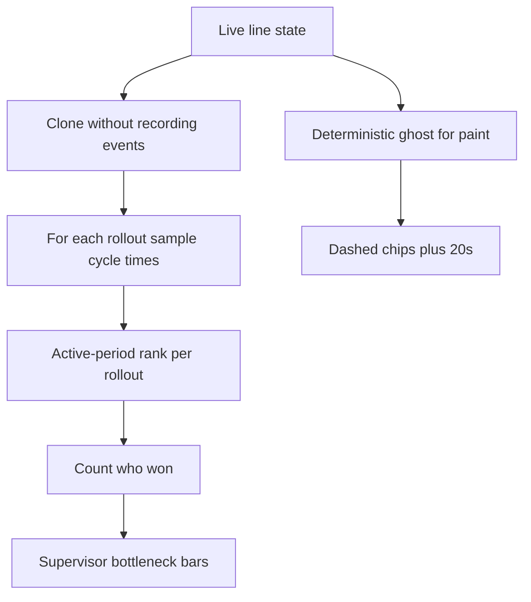

### 5.5 User flow — supervisor desk

1. Solid chips = floor now (green running / red slow / amber starved / grey blocked). Hatched = dark.
2. Dashed chips = ghost. When S3 goes red on the **ghost** first, that is the product.
3. Alert card: exact advisory sentence, no PLC language.
4. Three verbs: Accept / Defer / Dismiss + reason chip (see HITL-PRD §2.4).
5. Event log: `t=…s  twin ALERT S3 constraint` then `supervisor accept bottleneck S3`.

**Inject (demo only):** at t ≈ 16 s, scenario `s3_slow_weld` (S3 cycle ×2.2 **and** weld drift). This is a **maintenance-window fault injection**, not a live write.

### 5.6 Grade (closes Stage 1)

| Predicted | What happened in horizon | Grade |
| --- | --- | --- |
| S3 constraint | Downstream starve or S3 longest-active wins | TP |
| S3 constraint | Line stayed green | FP |
| No ticket | Starvation anyway | FN |
| No ticket | Green | TN |

Keep **bottleneck grades** off the weld confusion matrix. Mixing them is how plants lose the plot.

### 5.7 Acceptance

- [ ] Ghost is a forward clone, not a restyle of the live chips.
- [ ] Dark chips never show a single cycle time; CI or “dark” only.
- [ ] Accept never emits an actuator command.
- [ ] Dismiss of a bottleneck ticket does **not** drop weld at-risk IDs.

### 5.8 Prototype

Supervisor board: shops, ghost lane, bars, alert **with Accept/Defer/Dismiss**, inject/recover, pause/speed. Monte Carlo ranks **S2–S12** (S1 infinite supply is not a constraint). Stage 1 bottleneck grades (TP/FP/FN) sit on the manager desk, separate from weld QC. Defer suppresses repeats unless rank worsens 15pp. Three dismisses of the same type+station open a manager `detectors_vs_floor` ticket. The Live-twin story chapter runs this same 12-station engine.

---

## 6. Stage 2 — Grade (Week 2–3)

### 6.1 Goal

Defects are scored **in Body** and **honestly graded at Final**. A flag at S3 is not a scrap event; it is a babysit list until S12. Detectors train on **normal** operation (plants have no labeled defect archive). Isolation Forest is the fast filter; autoencoder confirms drift that sits **inside** classic SPC limits.

### 6.2 Two tickets, one body

| Ticket | Detector | Supervisor meaning |
| --- | --- | --- |
| `weld_suspicious` | Isolation Forest | Watch. Glance at tips. Do not tear the line down. |
| `weld_confirmed` | Autoencoder on the window | Babysit flagged IDs until inspect. Re-weld only if quality policy says so. |

Latent `weldDefect` is set on the body at S3 when drift is injected. The conveyor **does not stop**. S12 `qc` compares inspect fail/pass to `weldFlagged`.

### 6.3 System flow — weld to QC

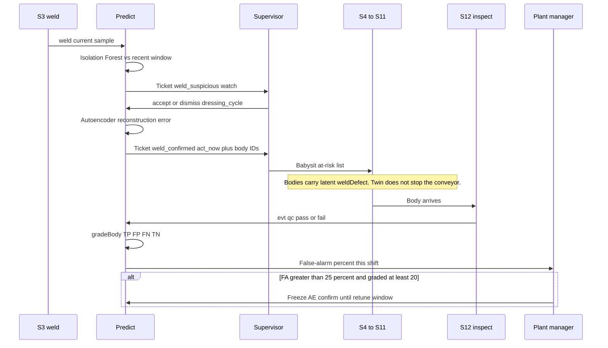

### 6.4 User flow — delayed defect (the R2 story)

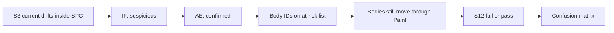

Supervisor playbook:

1. Suspicious → watch list + tell S3 operator to look at tips. **Never scrap from suspicious-only.**
2. Confirmed → babysit every flagged ID; optional re-weld per plant policy.
3. Bodies at risk walk at each break. None silently drop because someone dismissed a *bottleneck* ticket.
4. Rule of ten, named: accept-on-confirmed is a 1× re-weld; waiting for S12 with no list is a 10× tear-up.

QC inspector playbook: they do **not** “agree with the twin.” They pass or fail the body. The twin grades itself.

| Inspect | Twin had flagged | Result |
| --- | --- | --- |
| Fail | Yes | TP |
| Pass | Yes | FP |
| Fail | No | FN |
| Pass | No | TN |

FN on a **dark** weld cell is expected. That is a Stage 3 sensor argument, not a “tune IF harder” argument.

### 6.5 Manager flow — freeze

If `falseAlarmPct > 25` and `graded ≥ 20` in a rolling shift:

1. Twin opens `window_work` for the **manager** (not the supervisor).
2. Accept → IF may still show `watch`; AE **confirm** is muted until retune closes.
3. Dismiss → live with the FA; logged.

This is how false alarms die without a data-science intern on nights.

### 6.6 Data flow

```
S3 weld sample → weld[] window
  → isolationScore(latest vs bag) → suspicious
  → autoencoderError(recent vs baseline mean) → confirmed
body.weldFlagged sticky until S12
S12 qc → {tp,fp,fn,tn}
manager KPI = fp / (tp+fp) when (tp+fp)>0
```

### 6.7 Acceptance

- [ ] At-risk list shows body ID, model (A/B), and last known station.
- [ ] QC event exists only at S12.
- [ ] FA% is a manager KPI, separate from bottleneck grades.
- [ ] Freeze rule is printed even if n is too small in the demo (control disabled + copy).

### 6.8 Prototype

Weld wave, IF/AE flags, at-risk cards, QC grid, copilot `qc_grade` / `weld_status` / `bodies_at_risk`. Supervisor verbs on weld tickets. Manager freeze control is shown with the FA% / n≥20 rule (disabled until eligible).

---

## 7. Stage 3 — Dark honesty (Week 3)

### 7.1 Goal

A serial segment conserves flow: what goes in must come out. Dark stations stay on the twin as **80% CI bands**, never a fake point. The next ₹7k clamp is the dark cell whose CI width cuts forecast uncertainty the most — not “instrument everything.”

### 7.2 What ships / what does not

| Ships | Does not |
| --- | --- |
| Hatched chips + `[lo–hi]` | Point estimate on S4/S8 |
| `next_sensor` ticket into a **window backlog** | Live clamp appearing when the manager clicks |
| Uncertainty-cut % | Capex without leadership if over standing budget |

### 7.3 System flow — infer then spend

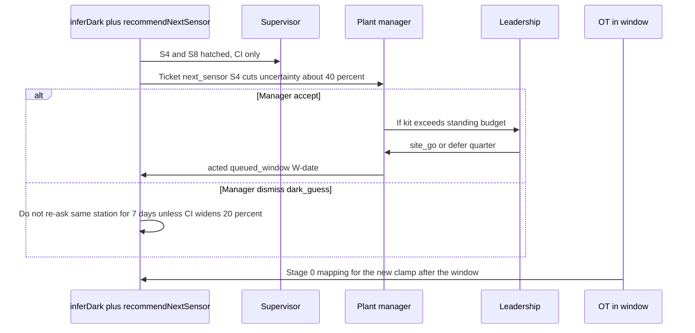

### 7.4 Infer internals

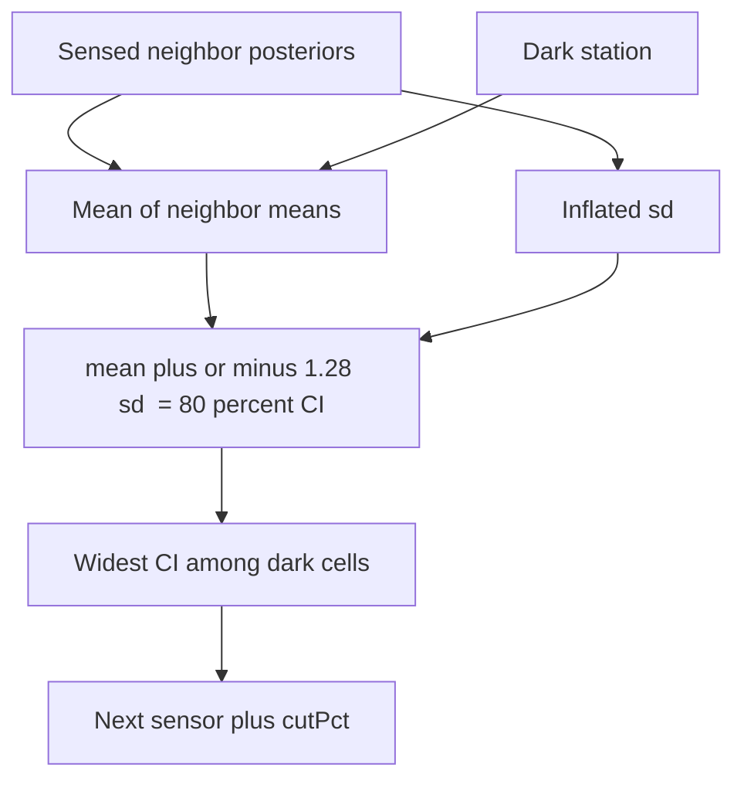

Supervisor **cannot spend**. They may leave a note `dark_guess` if they already distrust the band. Manager queues the window. Leadership unlocks budget.

### 7.5 User flow — manager coverage map

1. Coverage grid: green sensed, hatched dark (S4, S6, S8, S11).
2. Next-sensor card: station, CI, estimated cut %.
3. **Queue for window** — not “install now.” Recover in Ops is the demo of a window, not a purchase.
4. After install + one week of events, CI width on that station should drop. If it does not, reopen Stage 0 (mapping), do not blame the ranker.

### 7.6 Acceptance

- [ ] Dark station UI never renders a single number as “the cycle time.”
- [ ] `recommend_sensor` with all stations sensed returns “watch the constraint,” cutPct 0.
- [ ] Queue-for-window creates `window_work`, does not flip `sensed` live.

### 7.7 Prototype

Hatched chips, CI on supervisor dark rows, coverage map, next-sensor prose, **Queue for maintenance window** (does not flip `sensed`).

---

## 8. Stage 4 — Ask (ongoing)

### 8.1 Goal

Anyone can question the line. The copilot is a **witness**. The simulation is the truth. The human still owns Accept/Defer/Dismiss.

### 8.2 System flow

```mermaid
sequenceDiagram
  participant User as Supervisor or manager
  participant UI as Ask panel
  participant Parse as parseIntent
  participant Sim as Engine tools
  User->>UI: What if Station 4 runs 15 percent slower on night shift?
  UI->>Parse: parseIntent
  Parse->>Sim: what_if station 3 factor 1.15
  Sim->>UI: runLine plus answer
  UI->>User: Evidence line then prose
  User->>User: Still a Stage 1 or 3 ticket if they will act
  opt Misparse
    User->>UI: dismiss copilot_misread; rephrase
  end
```

### 8.3 Tool map

| User question (examples) | Tool | Twin may say | Human still must |
| --- | --- | --- | --- |
| When does the next bottleneck form? | `run_forecast` | Constraint, when, % of rolls | Stage 1 ticket to move people |
| What if S4 is 15% slower on nights? | `what_if` | Throughput delta, who stays constraint | Manager accepts a shift plan |
| Is the weld drifting? | `weld_status` | Suspicious vs confirmed | Stage 2 accept/dismiss |
| Which bodies are at risk until inspect? | `bodies_at_risk` | IDs and station | Physical babysit |
| False alarm vs QC? | `qc_grade` | TP/FP/FN/TN, FA% | Freeze rule |
| Where should the next sensor go? | `recommend_sensor` | Station + cut % | Stage 3 window |
| What is S4 really doing? | `estimate_dark` | CI band | Never treat as a stop-the-line |
| How long is S3 now? | `cycle_belief` | Posterior ± 80% CI, n | Context only |

**Guardrails**

- Print `▸ twin: {tool} · {rolls} rolls · {ms} ms` **before** prose.
- Low parse confidence (no station, no %) → clarifying chip, do not default-guess silently in production. Prototype may default S4 / 15% for the canned night-shift question.
- What-if is **not** Inject. Inject is a demo switch. What-if is a scratch scenario.
- Safety interlock questions → canned refuse: “Advisory twin. Talk to OT. No PLC.”

### 8.4 User flow — supervisor Ask

1. Preset chips or free text.
2. Evidence line appears first (trust).
3. If they will move people, **Promote to ticket** (HITL P2) — do not leave the answer as chat archaeology.
4. `copilot_misread` is a first-class dismiss code.

### 8.5 Acceptance

- [ ] No copilot path returns numbers that did not come from an engine function.
- [ ] Night-shift 15% S4 question routes to `what_if` with factor 1.15 and station index 3.
- [ ] Leadership is not expected to live in Ask.

### 8.6 Prototype

Presets + input on supervisor board. **Promote to ticket**, `copilot_misread`, and a canned PLC refuse.

---

## 9. Stage 5 — Three sites

### 9.1 Goal

Copy the **playbook**, not a frozen model. Each site gets Shop A’s priors as a Bayesian start, then its own Stage 0–2 and its own freeze threshold. Do not average false-alarm % across plants.

### 9.2 System flow — go / no-go

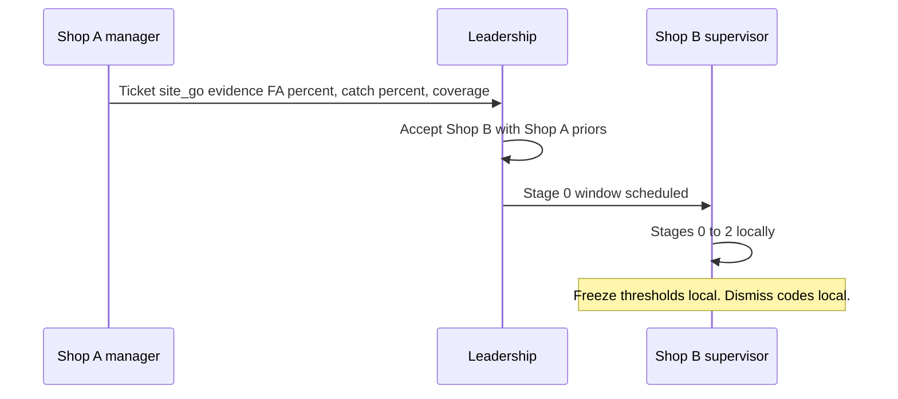

**Dismiss is not** “different PLC vendor” — we do not write PLCs. Dismiss **is** “no inspect gate to grade welds” (Stage 2 cannot close).

### 9.3 Leadership user flow

1. Cost card: remaining clamps on this stand-in, 12-station kit, 3× sites, “sensors only, not gateway.”
2. Risks already designed against: false alarms, dark CI, delayed defect, no PLC write, copilot tool-only, 12 ≠ 30–50.
3. Go / no-go is narrative in Round 2; explicit control is optional.

### 9.4 Acceptance

- [ ] Proposal and UI both say 12 stations stand in for 30–50.
- [ ] No claim of measured OEE lift from a live plant.
- [ ] Advisory-only copy on the leadership desk.

### 9.5 Prototype

Leadership KPIs + prose + Shop B go/no-go ticket.

---

## 10. Cross-cutting flows

### 10.1 Three desks, one `line` object

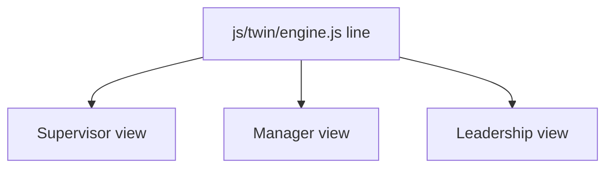

Switching tabs **must not** fork state. Pause/speed/inject are global. Manager heat and leadership cost are reads of the same tick.

### 10.2 Maintenance window (only time hardware changes)

Used by Stage 0 mapping, Stage 3 sensors, Stage 2 detector retune, demo Recover.

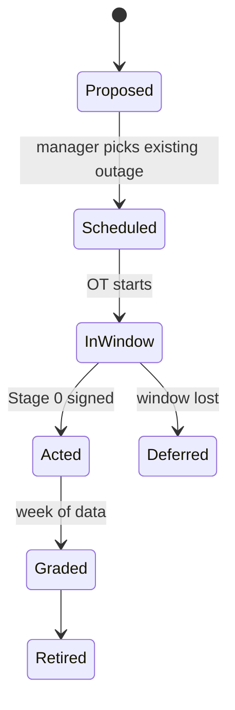

Ops **Recover in maintenance window** is this machine collapsed to one button so judges see “not a live PLC write.”

### 10.3 Scenario injector (demo)

| Control | Meaning | Not |
| --- | --- | --- |
| Inject S3 slow + weld drift | `applyScenario(s3_slow_weld)` at ~16 s or on click | A plant fault that appeared without a window |
| Recover in maintenance window | Clear slow/drift | Installing a clamp |

### 10.4 Escalation

| If | Then |
| --- | --- |
| `act_now` unacked past SLA | Banner stays; manager sees missed SLA count; **never auto-accept** |
| Three dismisses of same type+station in one shift | Manager ticket: detectors vs floor |
| FN weld | Review; do not page nights unless policy says so |
| Copilot asked to write a speed | Refuse |

### 10.5 Audit export (minimum)

`timestamp, ticket_id, type, station, body_ids, state, verb, reason_code, actor_role, evidence_tool, rolls, ms, grade`

Enough to reconstruct “operator accepted or rejected the recommendation” without claiming SCADA write-back. HITL P2 in the prototype.

---

## 11. UX rules by desk

| | Supervisor | Manager | Leadership |
| --- | --- | --- | --- |
| Clock | t = Ns, ghost +20 s | Shift throughput, busy-fraction heat | Quarter / 3-site cost |
| Primary widgets | Floor+ghost, bars, weld, log, at-risk, Ask | KPIs, heat, QC matrix, coverage, next sensor | Cost, rollout, risks, assumptions |
| `act_now` ack | Required | Sees missed SLAs | No |
| Spend | Comment only | Queue window | Unlock budget |
| Mobile | 40 px targets, reason chip on dismiss | Readable above the fold | Same |
| Reduced motion | Tickets still change state | Same | Same |

---

## 12. Requirements traceability (R2 brief)

| Brief complexity | Stage | Flow in this PRD |
| --- | --- | --- |
| Uneven sensor coverage | 0, 3 | Mapping; CI; next-sensor window |
| Multi-causal / intermittent | 1, 2 | Mix shift in posterior; reason codes `mix_shift`, `dressing_cycle`; inject slow **and** drift |
| No PLC / rare windows | 0, 3, 10.2 | Advisory only; `window_work`; Recover labeled as window |
| Delayed defect + root-cause | 2 | Latent flag at S3, QC at S12, at-risk list |
| Three stakeholder views | 10.1 | One `line`, three boards |
| Multi-site variation | 5 | Local freeze, local Stage 0, copy priors not weights |
| False alarms vs trust | 2 | Confusion matrix + freeze + dismiss codes |
| 30–50 stations, mixed-model | 1.2 | 12-station stand-in, A/B body IDs, stated in UI |
| Working prototype on illustrative data | Ops | Simulated events; `npm test` |
| Business proposal + README + video | Submission | PROPOSAL.md, README.md, docs/demo.mp4 |

---

## 13. Functional requirements (testable)

Engine (`js/twin/engine.js` + `test/twin.test.js`):

- F1. 12 stations, 3 shops, CAP 4, S12 inspect, S3 weld.
- F2. Default sensed mask 8/12 with S4 and S8 dark; dark stations emit no `enter`/`exit`.
- F3. Body IDs `A-|B-` with SUV cycle multiplier.
- F4. Posterior starts at standard time; moves toward slower obs.
- F5. Ghost is a forward copy; live `t` unchanged.
- F6. Monte Carlo bottleneck shares sum near 100; slowing a station drops `what_if` throughput.
- F7. `inferDark` returns lo < hi for a dark cell; `recommendNextSensor` picks a dark cell.
- F8. Injected weld drift becomes `suspicious` or `confirmed`; QC at S12 produces at least one graded cell.
- F9. Copilot routes night-shift 15% S4 to `what_if` factor 1.15 station 3; forecast answers contain `S[1-12]`.

Ops UI:

- U1. Three tabs, one engine, no state fork.
- U2. Ghost chips vs floor chips.
- U3. Inject at ~16 s or click; Recover labeled maintenance window.
- U4. At-risk list until inspect; QC grid on manager.
- U5. Ask prints `▸ twin:` evidence line.

HITL (implemented in Ops): see [HITL-PRD.md](HITL-PRD.md) §13.

---

## 14. Non-goals (say this in every demo)

3D rendering, MES integration, PLC upgrades, unit-level genealogy beyond body ID + last station, closed-loop control, SUMO/ASM wastewater models, badge SSO, historian write, electronic work instructions.

---

## 15. Success

A floor supervisor can say, in one sentence, **what the last alert was, what they did, and how they will know at inspect whether they were right.**

If they cannot, the twin is a dashboard, not a product.
